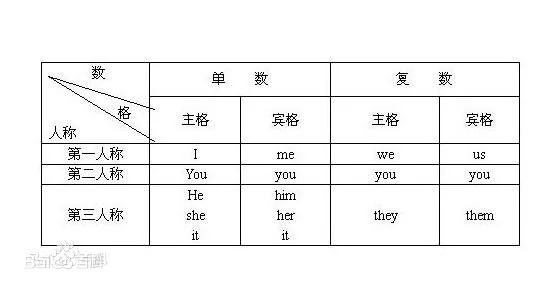
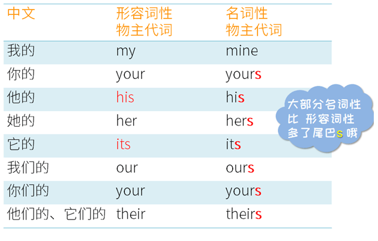
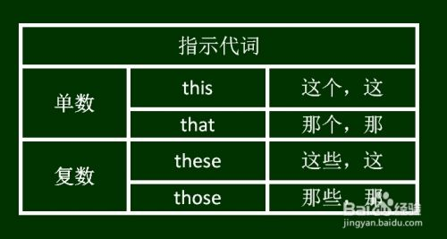

## 介绍
代词是为了避免重复而代替名词的词语。生活中使用代词的频率非常高，因为我们不能老是重复相同的名词。比如：“Wangjp is a student. Wangjp is from Hubei. Wangjp study English” 这离连续使用了三个名词“Wangjp“，这样就变得重复啰嗦了，应该用一个代词代替其它两个重复的名词：“Wangjp is a student. He is from Hubei. He study English” 上面的“He”就代替名词“Wangjp”，也叫**人称代词**。

## 人称代词
人称代词分为**主格**和**宾格**，**主格**就是作主语的格式，**宾格**就是作宾语的格式。人称代词的分类如下：
  
注意：不能拿主格来作宾语，也不能拿宾语来作主语。但主格和宾格都可以作表语，如：Who is it? 谁啊? It is me/I 是我。

## 物主代词
表示所有关系的代词叫物主代词。物主代词包括**形容词性物主代词**和**名词性物主代词**。  
  
区别：比如“这是我的书”（This is my book），这里的“我的”在中文里是定语，修饰名词“书”，所以这就是个形容词词性物主代词。比如“你的书比我的贵”（Your book is more expensive than mine），这里的“我的”在中文里的含义是“我的书”，实际上是指“书”，也就是属于名词的意义，所以这里的“我的”是一个名词性物主代词。

## 指示代词
指示代词只有两个，“this”和“that”，还有它们的复数：“these”和“those”，一般“近的”使用“this”，“远的”使用“that”。  
  
注意：“This”和“That”作前置定语，专门修饰或限定单数的可数名词，不能修饰复数，不过可以修饰不可数名词。“These”和“Those”也可以作前置定语，修饰或限定可数名词复数，只能修饰可数名词复数，不能修饰单数，也不能修饰不可数名词。