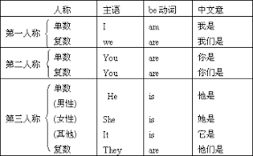

## 介绍
动词就是表示动作或者心理行为的词语。动词从用法来分，可以分为**谓语动词**和**非谓语动词**。它们的区别就是一个作谓语，另一个不能做谓语（做主语，表语，宾语等）

## 谓语动词
谓语动词指在句子中作谓语的动词，主要分为四种：
### 实义动词
实义动词表示有实际意义的动词，实义动词又分为**及物动词**和**不及物动词**
1. 及物动词  
及物动词就是后面一定要加宾语的动词，也就是加一个动作的对象或者承受者。例如：“买（buy）”这个动词，我们造句的时候，不可能只说：“我买”，而是说“我买是什么东西”。  
造句格式：主语 + 及物动词（谓语）+ 宾语
2. 不及物动词  
不及物动词就是后面不需要加宾语的动词，而且也不能加宾语，因为意思已经完整了，不需要宾语了。例如：“work” 是工作的意思，“I work every day”（我每天工作），“I work” 意思已经完整了，不需要再加宾语了。  
造句格式：主语 + 不及物动词 + 状语
### 系动词
系动词的作用是跟表语构成“表语结构”作状态型谓语，系动词不能单独使用，必须和表语一起用。最常见的系动词就是“be”，“be”有八种形式，用法如下：  

### 助动词
助动词是没有意思的，它的作用就是**帮助实义动词或系动词构成复合谓语**，或者构成疑问句、否定句、以及构成各种时态、语态和语气。常见的助动词有：be、do、will、would、shall、should 等。注意：没有专门的助动词，都是从其它动词里借来的，例如：“I am working now” 我现在正在工作。在这里，“am” 是完全没有意思的，主要的作用是跟动词的现在分词构成现在进行时态。“am” 符合助动词的特点：1.没有意思，2.帮助构成其它语句，3.从系动词借过来用的
### 情态动词
情态动词的作用就是跟动词原型（包括动词短语原型，系动词 be）构成复合谓语。情态动词本身有意义，但是不完整，以下为常见的情态动词的用法：  

## 非谓语动词
非谓语动词，又叫非限定动词，非谓语动词是指在句子中不是谓语的动词，主要包括不定式、动名词和分词（现在分词和过去分词），即动词的非谓语形式。 非谓语动词除了不能独立作谓语外，可以承担句子的其他成分。

## 时态
动词的时态分为五种：原形、过去式、过去分词、现在分词、第三人称单数。一般的变化形式如下图，特殊的需要单独记忆。  
  