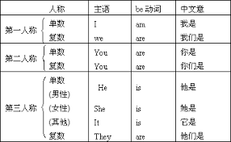

## 介绍
句子成分就是构成句子的各个部分。英语的句子成分总共个：**主语**、**谓语**、**宾语**、**表语**、**补语**、**定语**、**状语**，还有一个不太重要的**同位语**。

## 主语
主语是一个句子叙述的主体，一句话概括就是主要叙述的**对象**或主要讲的**内容**。例如：“I am a student” 我是一个学生。这里的主语就是 “I”，凡是**名词**都可以作为主语。

### 组成
1. 名词   
名词都可以作主语
2. 人称代词/指示代词   
人称代词只有**主格**才可以作主语，指示代词 “this”、“that” 等，也可以作为主语，例如：“This is my pen.” 这是我的钢笔。（指示代词 this 作主语）
3. 数词  
数词可以做主语，例如：“The first is important.” 第一很重要，这里的“第一”就是主语。
4. 动词不定式/动词不定式短语  
例如：“To learn English is easy.” 学英语很容易。（这里的 “To learn English” 作主语）
5. 动名词/动名词短语  
例如：“Learning English is funny.” 学英语是有趣的。（这里的 “Learning English 作主语”）
6. 句子  
一个句子也可以作主语。作主语的句子我们叫它主语从句。
7. 其它  
在英语里面，有些名词看起来不是名词，但是具有名词的含义。比如，“old” 本来是形容词，“the old” 表示 “老人” 的意思，所以可以作主语。类此的词语还有：this old（老人）、this poor（穷人）、this rich（富人）。

## 谓语
谓语是说明主语**动作**或者**状态**的词语。例如：“I eat an apple everyday” 我每天吃苹果。这里的 “eat” 就是谓语，动作型谓语，表示我做了什么。例如：“I am an English teacher” 我是一个英语老师。这里的 “am an English teacher” 也是谓语，状态型谓语，表示我是什么。

### 动作型谓语
动作型的谓语由**动词**（表示**动作**或者**心理活动**的词语）构成，例如： eat（吃），drink（喝）,think（思考）,konw（知道）。动作型谓语又分为两种：
#### 简单谓语  
简单谓语由**实义动词**或**动词短语**构成。**实义动词**就是表示“有实际意义”的动词，用来区分“系动词”、“助动词”、“情态动词”。**动词短语**就是由动词和另一个单词或者几个单词构成的词组，虽然由几个单词构成，但实际只表示一个动作，例如：“look after”，中文“照顾”的意思，只是一个动作。
#### 复合谓语
复合谓语就是由**简单谓语**再加上**其它词语**共同作谓语的情况，主要有以下三种情况：
1. 情态动词 + 实义动词或者动词短语的原形    
例如：“I can speak Mandarin” 我会说普通话。这里的 “can + speak” 就是复合谓语（情态动词 + 实义动词）。例如：“I can look after her” 我可以照顾她。这里的 “can look after” 就是复合谓语（情态动词 + 动词短语）。
2. 助动词 + 实义动词或者动词短语的原形    
例如：“I will buy a new book tomorrow” 我明天要买一本新书。这里的 “will buy” 就是复合谓语（助动词 + 实义动词）。例如：“I will get up early tomorrow” 我明天要早起。这里的 “will get up” 就是复合谓语（助动词 + 动词短语）。
3. 助动词 + 其它的动词形式（be + doing 或 Have/has + done）  
例如：“I am working now” 我现在正在工作（现在进行时态）。

### 状态型谓语
状态型的谓语由**系动词**加**表语**构成。系动词主要由 “be” 充当，所以经常说 “be + 表语”。"be" 是一个非常重要和特殊的单词，表示“是”的意思，有八种形式："be、am、is、are、was、were、being、been"，但它们的意思都相同。常见的 “be” 动词用法如下：  

例子：“He is a doctor” 他是一名医生。is 是系动词，a doctor 是名词作表语，所以状态型谓语就是 “is a doctor”。

## 宾语
宾语是最容易理解的句子成分，宾语就是动作的对象或者承受者，能作主语的词语都可以作宾语。

### 组成
1. 名词  
例如：“I buy apples every day” 我每天买苹果。这里的苹果就是宾语。
2. 人称代词的宾格作宾语  
例如：“I believe her” 我相信她。这里的她就是宾语。
3. 数词作宾语  
例如：“I want two” 我要两个。这里的 two 就是宾语。

### 宾语补足语
在英语里面，有些动词加上宾语之后，意思还是不完整，这个时候需要加上一个词语补充宾语的意思，使整个句子意思完整。这个补充宾语的词语，就叫宾语补足语，简称宾补。例如：“make” 有“制造、使、让”的含义，如果说：“I make you”（我使你），意思就不完整。但是，如果加上一个词语“happy（快乐）”，这个句子意思就完整了：“I make you happy（我使你快乐）”。

## 表语
表语的定义跟谓语一样的，说明主语是什么或者怎么样的词语。不同的是表语是跟在系动词后的，**系动词和表语不能分开，没有系动词就没有表语，没有表语就没有系动词**。

### 组成
1. 名词  
例如：“He is a doctor” 他是一个医生。这里的 doctor 就是名词充当表语。
2. 形容词  
例如：“I am rich” 我有钱。这里的 rich 就是形容词充当表语。
3. 介词短语  
介词表示位置、方向、时间等概念的词语。例如：“I am in Beijing” 我在北京。这里的 in Beijing 就是介词短语充当表语。
4. 名词所有格
5. 动词不定式
6. 动名词
7. 代词
8. 数词
9. 分词
10. 副词
11. 句子

## 补语
## 定语
## 状语
## 同位语