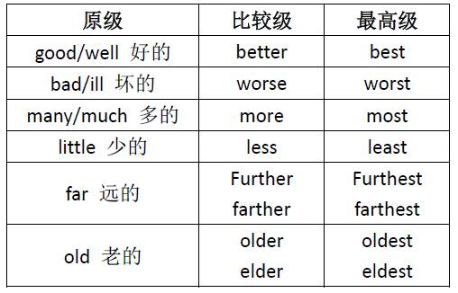

## 介绍
形容词主要用来修饰名词或代词，表示人或事物的性质、状态、特征的程度好坏与否。

## 分类
### 普通形容词
例如：big（大的）、long（长的） 等词语。
### 复合形容词
复合形容词就是由两个单词构成的一个新的单词，这个新词也属于形容词的词性。两个单词之间有一个符号“-”，例如：sky-blue（天蓝色的）、good-looking（好看的）。

## 作用
形容词的用法不多，一般可以作定语、表语和宾补。
1. 作表语  
大部分的形容词都可以作表语，形容词作表语可以直接构成一个句型：主语 + be（系动词）+ 形容词（表语），例如：I am happy 我很快乐。
2. 作前置定语  
大部分的形容词都可以作前置定语，修饰普通名词，放在普通名词的前面，例如：The big House 这个大房子。（big 作前置定语修饰名词 house）
3. 作宾语补足语  
形容词可以作宾补，但是只有部分特定的及物动词后面才可以跟形容词作宾补，比如：Make（使，让）、keep（保持）等等。例子：I make you busy 我让你忙。（这里的 busy 就是宾语补足语）

## 比较级和最高级
大部分的形容词都有三个格式：原级、比较级和最高级。比较级就相当于中文的“更”的意思，最高级就相当于“最”。比如：漂亮的是一个形容词，那么更漂亮就是比较级，最漂亮就是最高级。
  
形容词的比较级和最高级跟形容词的原级一样，可以作定语、表语和宾补。